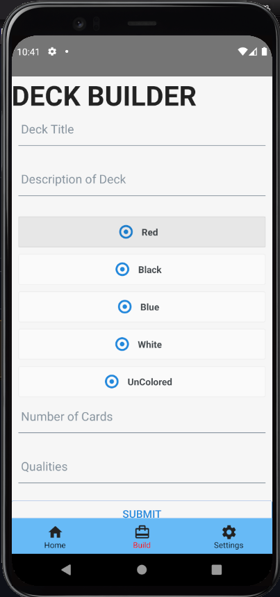

# Rule Zero

## Description:
This is a Capstone project created by Software Developers from Tech Talent South that is designed to assist players
of Magic: The Gathering with the organization and categorization of their constructed decks.

## Group Members:
* Joshua Luppes
* Megan Lowe
* Keya Daniel
* Ryan Kirk
* Shantel Taylor

## Software used
* Java
* Spring Boot
* React, React Native
* Bootstrap
* [Scryfall API](https://scryfall.com/docs/api)

<p align="left"> <a href="https://developer.android.com" target="_blank">  </a> <a href="https://getbootstrap.com" target="_blank">  </a> <a href="https://www.docker.com/" target="_blank">  </a> <a href="https://git-scm.com/" target="_blank">  </a> <a href="https://heroku.com" target="_blank">  </a> <a href="https://www.w3.org/html/" target="_blank">  </a> <a href="https://www.java.com" target="_blank">  </a> <a href="https://developer.mozilla.org/en-US/docs/Web/JavaScript" target="_blank">  </a> <a href="https://www.postgresql.org" target="_blank">  </a> <a href="https://reactjs.org/" target="_blank">  </a> <a href="https://reactnative.dev/" target="_blank">  </a> <a href="https://spring.io/" target="_blank">  </a> <a href="https://webpack.js.org" target="_blank">  </a> </p>

## Setup
The application consists of two main parts:
1. The backend server, built with Spring Boot
2. The frontend client, built with React Native

During the current stage of development, both parts can be run locally, and will interact with each other on your
machine.

### Backend Server
Clone the project, and build with Gradle. Once dependencies have downloaded, run the RuleZeroApplication.java file
to start the server running. Commands can be sent via HTTP requests to the various endpoints, hosted at 
http://localhost:8080 . Documentation for various endpoints can be found at http://localhost:8080/swagger-ui/index.html

### Frontend Client
Launch the Metro task, and let that start completely.
Run the react-native starter command in your terminal, and the app will launch on your emulator.

## Code examples
Color output can be determined from a String characteristic, demonstrated in the following code snippet:
```Java
public String getColors(String colorInput) {
    StringBuilder colorOutput = new StringBuilder();
    for (int i = 0; i < colorInput.length(); i++) {
        if (!colorOutput.toString().contains("" + colorInput.charAt(i))) {
            colorOutput.append(colorInput.charAt(i));
        }
    }
    return colorOutput.toString();
}
```


## Features

1. Create, read, update, and remove decks from the database
2. Add cards to your decks, featuring data pulled from the public Scryfall API
3. Client app is mobile and web friendly


## Status
This project is under development. Not all features are currently implemented. 

<h4>Screenshots:</h4>

